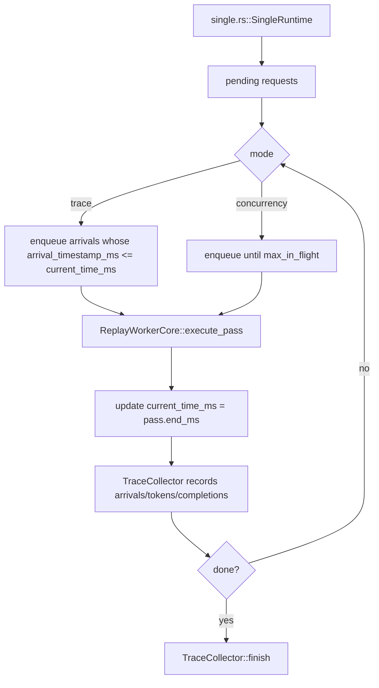
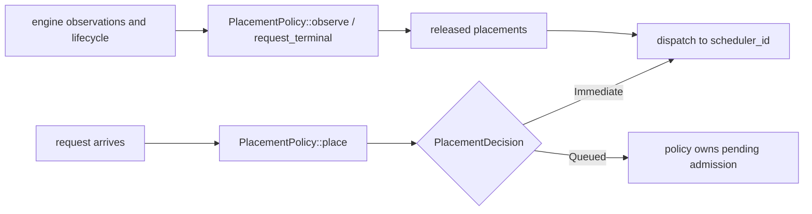

<!--
SPDX-FileCopyrightText: Copyright (c) 2026 NVIDIA CORPORATION & AFFILIATES. All rights reserved.
SPDX-License-Identifier: Apache-2.0
-->

# AISimulate Replay

This crate owns the Dynamo-neutral, in-process replay runtime. It simulates a
trace without async runtimes, network planes, or real worker tasks: the
`Replayer` advances a logical clock, drives Generalized Mocker Engines from
`aisimulate-engine`, and records request and token timing in `TraceCollector`.

For operator-facing CLI documentation, see
[`dynosim-replay.mdx`](../../../docs/fern/pages/cli/operations/simulation-with-dynosim/dynosim-replay.mdx).
This README covers the virtual clock, event queue, logical workers, and the
placement/scaling boundary used by Dynamo adapters.

## Where It Sits

The public entrypoint is `Replayer<C>`, where `C: ReplayComposition` supplies
placement and optional scaling policies. `RoundRobinComposition` is built in;
Dynamo constructs Router/Planner policies in `lib/mocker` and injects them
through the same contract. The dependency points only toward this crate.

`Replayer::run` selects one of three implementations:

- `single.rs` for aggregated replay with one worker and one DP rank when the
  composition permits the fast path
- `agg.rs` for aggregated multi-worker or attention-DP replay
- `disagg.rs` for disaggregated prefill/decode replay

## File Map

- `src/replayer.rs`
  Owns the canonical replay entrypoint and composition boundary.
- `src/single.rs`
  Minimal replay loop for one aggregated worker.
- `src/agg.rs`
  General offline cluster simulator for multi-worker replay.
- `src/disagg.rs`
  Offline two-stage replay harness with separate prefill and decode pools.
- `src/state.rs`
  Per-worker state used by the preserved single-worker path.
- `src/event.rs`
  `SimulationEvent`, `SimulationEventKind`, and worker-completion payload types used by the multi-worker harness.
- `src/components/`
  Admission, logical-worker, and Generalized Engine orchestration shared by the
  aggregated and disaggregated runtimes.
- `src/core/`
  Neutral placement contracts and built-in round-robin policies.
- `src/runtime_utils.rs`
  Shared helpers used by `agg.rs` and `disagg.rs`: event scheduling,
  `ReadyWorkerCompletions`, and `next_timestamp`.
- `src/progress.rs`
  `ReplayProgress`, the indicatif-based progress bar used by the harnesses.
- `src/report.rs`
  `TraceCollector` and the serializable `TraceSimulationReport`.
- `src/spec.rs`
  Canonical, serializable `ReplaySpec` and topology/provider descriptors.

## Single-Worker Fast Path

The single-worker path is intentionally simple and used when `num_workers == 1`
and `dp_size == 1` for vLLM, SGLang, and TRT-LLM engine modes. Multi-rank
attention-DP uses the general harness so each rank has an independent scheduler
and KV pool while all ranks still share one deterministic event loop and a
group-owned iteration clock.

That path avoids the cluster event queue and router machinery entirely, but it now supports both:

- flat request replay
- workload-driven replay through `WorkloadDriver` for multi-turn/session traces



Important details:

- Trace mode uses `normalize_trace_requests` in `src/lib.rs` so the first request starts at `0 ms`, then applies `arrival_speedup_ratio`.
- Concurrency mode ignores original arrival spacing and keeps the worker filled up to `max_in_flight`.
- Workload trace mode honors first-turn timestamps and inter-turn delays.
- Workload concurrency mode ignores first-turn timestamps but still enforces inter-turn delays after completion.
- The worker itself is still the real mocker engine core; only the scheduling loop is simplified.

## Multi-Worker Harness

The general aggregated harness lives in `src/agg.rs`. It models a cluster with:

- a logical clock `now_ms`
- a pending request queue
- one `EngineComponent` logical worker per simulated worker
- a binary heap of future completion events
- an injected placement policy

For `dp_size > 1`, each logical worker owns one grouped Generalized Mocker
Engine containing one scheduler per DP rank. The placement policy retains the
live `(worker_id, dp_rank)` identity; scaling and
worker accounting continue to count mocker workers rather than rank schedulers.
At each iteration, every ready rank forms its scheduler-local pass and the logical
worker completes at the maximum rank latency. Completion-visible tokens, KV events,
and FPM timing share that boundary; empty ranks also wait at the barrier so arrivals
during an epoch cannot start early.

### Main Loop

The aggregated harness is event-driven. It does not sleep. Instead, `AggRuntime` repeatedly:

1. picks the next meaningful timestamp
2. advances `now_ms`
3. applies any worker completion events scheduled for that time
4. admits newly available requests, either from trace arrivals or concurrency backfill
5. starts passes on workers that are ready to run
6. pushes new `WorkerCompletion` events back into the binary heap

It only advances `now_ms` to the next meaningful timestamp:

- next request arrival
- next worker completion event

### Worker Model

Each multi-worker logical worker is represented by `EngineComponent` in
`src/components/engine.rs`:

- wraps one `NativeGeneralizedEngine`
- tracks whether a pass is currently in progress
- tracks in-flight request count separately from engine internals
- optionally publishes neutral native KV observations to its composition

The pass execution itself still comes from the moved vLLM, SGLang, or
TensorRT-LLM scheduler core through the shared Generalized Engine contract.

So offline replay is not a toy simulator. It reuses the real per-pass mocker scheduling logic, but drives it deterministically.

## Completion Event Queue

The multi-worker and disagg harnesses use `SimulationEvent` from `src/event.rs`
as a min-time priority queue implemented with `BinaryHeap`. The event carries a
scheduled timestamp, a sequence number for deterministic tie-breaking, and a
typed payload:

```rust
pub(crate) struct SimulationEvent<Events> {
    pub(crate) at_ms: f64,
    pub(crate) seq_no: u64,
    pub(crate) kind: SimulationEventKind<Events>,
}

pub(crate) enum SimulationEventKind<Events> {
    EnginePassCompletion(EnginePassCompletion<Events>),
    TransferComplete { handoff_id },
    WorkerReady { stage, worker_id },
    ScalingTick,
}
```

- `EnginePassCompletion` makes one grouped pass visible at the Generalized
  Engine's slowest-rank completion boundary.
- `TransferComplete` advances a disaggregated request after modeled handoff
  timing.
- `WorkerReady` marks the point at which a worker returns to the admission pool after a pass completes.
- `ScalingTick` gives the injected scaling policy a settled cluster snapshot.

## Placement and Scaling Integration

Replay depends on the neutral `PlacementPolicy<Request>` and
`ReplayScalingPolicy` contracts. The built-in engine stack uses synchronous
round-robin placement and no scaling. Dynamo's composition implements the same
boundary with `KvRouterPlacement` and an optional Planner policy; Dynamo owns
the concrete Router configuration, indexer, and policy construction.

This router is synchronous and in-process:

- no async worker tasks
- no event plane
- no background indexer thread

Instead it maintains:

- a local radix tree indexer
- local `ActiveSequencesMultiWorker` state
- a pending queue for queued requests



### Why KV events are captured only where needed

When a composition requests native observations, each Generalized Engine pass
returns neutral KV events. `ReplayEngineObservation` converts them at the
adapter boundary; the AISimulate crates never import Dynamo Router event types.

In round-robin mode, this capture is skipped because nothing consumes those events.
In offline disagg replay, only the prefill workers capture and publish KV events; the decode workers
run with capture disabled because the decode router is overlap-blind and does not consume router
events.

## Disaggregated Harness

The disaggregated runtime in `src/disagg.rs` models two distinct stages:

- a prefill router and prefill worker pool
- a decode router and decode worker pool

Attention-DP is currently supported only by aggregated offline replay. Disaggregated replay
requires both prefill and decode `dp_size` to be `1`; ranked prefill/decode routing and handoff
semantics are not yet modeled, so larger values are rejected explicitly instead of using the old
aggregate approximation.

It keeps one logical clock and one completion-event heap, but request ownership moves through a
two-stage state machine instead of the aggregated single-pool lifecycle.

The prefill router is derived from the main router config with `router_track_active_blocks = false`.
The decode router is derived with:

- overlap disabled
- `assume_kv_reuse = false`
- `track_prefill_tokens = false`

The prefill stage runs a hidden synthetic one-token bootstrap request. When prefill completes, the
harness:

1. applies any prefill KV events
2. marks prefill complete in the prefill router
3. frees prefill router state
4. enqueues the original request into decode at the same logical timestamp

Decode then runs with normal collector visibility. The public replay report remains decode-only, so
TTFT includes prefill queueing and prefill compute.

## Trace vs Concurrency Modes

Both single and multi harnesses support two admission modes:

- Trace mode
  - for flat requests, respects input arrival timestamps
  - for workloads, respects first-turn timestamps and inter-turn delays
  - timestamps are normalized so the first request or first session starts at `0 ms`
  - `arrival_speedup_ratio` compresses or stretches inter-arrival gaps and inter-turn delays

- Concurrency mode
  - ignores original first-turn spacing
  - single-turn request lists: keeps up to `max_in_flight` requests in flight
  - multi-turn session traces: `max_in_flight` caps active **sessions**, and a session holds
    its slot across all its turns and inter-turn think-time (i.e. a new session starts only
    when an active one finishes).
  - stamps synthetic arrival times as requests are admitted

`ReplaySpec::max_in_flight` selects concurrency mode; omitting it selects trace
mode. Dynamo's compatibility entrypoints lower legacy inputs into the same
`Replayer` rather than maintaining a second event loop.

## Metrics Collection

All runtimes emit request timing into `TraceCollector` in `src/report.rs`:

- arrival
- admission
- token emission
- completion

The harness does not compute final throughput/latency metrics incrementally. It
records events, then `TraceCollector::finish()` derives the final
`TraceSimulationReport`.

## Mental Model

The easiest way to think about offline replay is:

1. Reuse the real mocker scheduling pass logic.
2. Replace wall-clock async execution with a deterministic logical clock.
3. Optionally replace networked router behavior with a synchronous in-process router model.
4. Record the same request lifecycle timings into `TraceCollector`.

That keeps the harness fast, reproducible, and close to the real scheduler behavior without needing to boot a live runtime.
