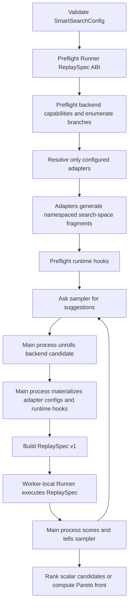

> [!WARNING]
> **Experimental.** Spica is intended for evaluation and feedback, not production capacity
> planning. Its API, configuration schema, search results, and deployment output may change
> without a standard deprecation period.

Spica turns a deployment-tuning question into a replay-backed search. A `SmartSearchConfig`
provides backend knobs, optional adapter search spaces, one workload, one optimization goal, and
sweep run control.

## Ownership

| Layer | Owns | Does not own |
|---|---|---|
| Spica core | backend search space, parallel enumeration, Vizier orchestration, `ReplaySpec`, scoring, cache, worker lifecycle | Planner or Router semantics, a concrete replay runtime |
| Simulation adapter | feature-specific search-space generation and per-candidate runtime-hook materialization | worker execution, scoring, process pools |
| Replay runner | execution of a complete `ReplaySpec`, supported backend/topology pairs, supported runtime hooks | optimizer suggestions or adapter search-space generation |

The AI Simulate distribution has no `ai-dynamo` dependency. The Dynamo wheel owns its Planner and
Router adapters and the runner composition that injects them into the shared Replayer.

## Sweep Flow

Adapter code runs in the main process. Worker tasks receive only a serializable `ReplaySpec`; they
do not import or pickle adapter objects. Each worker creates one runner and reuses it for candidate
replays.

## Adapter Search Preparation

An adapter implements two operations:

1. `generate_search_space(search_spec, context)` validates the complete adapter-owned search space
   and returns branch-specific categorical or continuous parameters plus prepared state.
2. `materialize_replay(plan, selection, context)` turns one namespaced optimizer selection into an
   `AdapterReplaySpec` with concrete configuration and zero or more runtime hooks.

For example, the Planner adapter derives the load-predictor search from all configured scaling
intervals during `generate_search_space`. It does not receive a single concrete `PlannerConfig`.

Spica namespaces optimizer parameters as `adapter::<adapter name>::<local parameter>`. Namespacing
prevents collisions without exposing adapter fields in the core `SearchSpace` model.

## Replay Contract

`ReplaySpec` version 1 contains:

- one `BackendDeploymentSpec` with the topology, backend version, engine arguments, and worker
  counts;
- the validated workload and optimization goal;
- the concrete concurrency when KV-load search derives one;
- a mapping of adapter names to concrete adapter configuration and runtime hooks.

Before execution, `RunnerCapabilities` verifies the replay-spec version, backend/topology pair,
and every runtime hook. Unsupported combinations fail before the optimizer spends trials on them.

## Search and Failure Semantics

Spica preserves the existing barrier-round behavior:

- Vizier ask/tell stays in the main process.
- Suggestions are projected onto backend-supported parallel configurations.
- Exact repeated suggestions use the run-local result cache.
- Candidate build failures, replay failures, GPU-budget violations, and timeouts are reported as
  infeasible trials.
- Parallel evaluation uses worker-sized waves so queued work does not consume a candidate timeout.
- A timed-out worker pool is terminated and replaced. Gracefully stopped runners receive `close()`;
  a force-terminated process cannot guarantee cleanup callbacks.

The cache remains keyed by the raw suggestion and prepared search context in this refactor. Search
domains, scoring, and replay results retain their existing behavior while `ReplaySpec` becomes the
execution boundary. Adapter namespacing and parameter registration order can change Vizier's exact
finite-round suggestion sequence, so parity does not require an identical optimizer trajectory.

## Replay Composition

`DynamoReplayRunnerFactory` converts each serializable `ReplaySpec` into a shared Replayer
invocation:

- backend-only Spica targets the Dynamo-free replay runner;
- Spica with Dynamo hooks targets the Dynamo replay composition.

This split keeps one Spica core and one replay implementation while Dynamo owns only its policy
adapters.

## Related Documentation

- [Optimization Goals](optimization-goals.md) describes the `OptimizationGoal` targets, SLA, scoring,
  and how the goal maps to the planner's `optimization_target`.
- [Traffic](traffic.md) describes the `Workload` load shapes (trace, request rate, fixed
  concurrency / KV load) and candidate-relative Pareto load sweep.
- [Search Space](search-space.md) lists every pinnable or searchable knob, the composite presets,
  and `parallel_configs`.
- [Unrolled Samples](unrolled-samples.md) explains how a Vizier suggestion becomes a concrete deployment.
