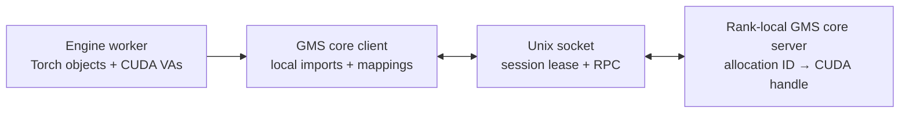

<!--
SPDX-FileCopyrightText: Copyright (c) 2026 NVIDIA CORPORATION & AFFILIATES. All rights reserved.
SPDX-License-Identifier: Apache-2.0
-->

# GPU Memory Service Snapshot V1

Snapshot V1 is an experimental GMS profile for engines that are always
replenished from a Dynamo Snapshot. CRIU preserves the process, Torch object
graph, tensor layouts, and CUDA virtual addresses. GMS therefore needs to
preserve only model Parameter backing and make it available again at those
checkpointed addresses.

## Architecture



There is one GMS server per engine rank. The server stores opaque allocation
IDs, aligned sizes, and retained CUDA allocation handles. It does not store
tensor metadata, module paths, StorageImpl identities, layouts, or client
virtual addresses. Export file descriptors are transient: the server creates
one for an export response and closes its copy after sending it with
`SCM_RIGHTS`; the client import consumes and closes the received descriptor.

The core contains mechanisms shared with other GMS profiles:

- physical allocation ownership;
- Unix-socket session admission and disconnect cleanup;
- RW-to-RO commit;
- local CUDA reserve, import, map, access, unmap, and release operations;
- Torch pluggable-allocator and MemPool construction; and
- alias-preserving tensor isolation.

V1 adds only Snapshot policy: fresh construction, Parameter selection,
commit, sleep, and exact-address wake.

## Socket sessions

The connected, handshaken Unix socket is the lease:

- one RW session excludes readers;
- multiple RO sessions share a committed allocation epoch;
- `RW_OR_RO` receives RW for an empty epoch or RO for a committed epoch;
- a waiting writer blocks later readers;
- commit changes the same socket from RW to RO; and
- disconnect releases the lease. Disconnecting an uncommitted writer also
  clears its partial allocation epoch.

There is no unlock RPC, heartbeat, TTL, reconnect, or rollback protocol. The
server detects a queued client disconnect and removes it from lock contention.

## Snapshot lifecycle

```mermaid
stateDiagram-v2
    [*] --> Constructing: constructor opens RW
    Constructing --> Committed: mappings become RO; commit same socket
    Committed --> Asleep: unmap imports; close RO socket
    Asleep --> Committed: open RO; import IDs at saved VAs
```



A fresh V1 manager opens RW and allocates model-loading storage through GMS.
Commit changes every surviving mapping to read-only and commits the same
socket. Sleep unmaps and releases local imports, keeps the virtual-address
reservations and allocation IDs, then closes the RO socket.

CRIU restores the manager in its sleeping state; constructors do not rerun.
Wake opens RO against the checkpointed server identity, exports the saved
allocation IDs, and maps them read-only at the checkpointed virtual addresses.
The sidecar never needs to know those addresses.

Failures are fail-stop. V1 closes its socket and propagates the error; it does
not retry, reconnect, compensate, or roll back partially completed lifecycle
operations.

## Parameter capture and tensor isolation

V1 uses vLLM's existing broad `weights` allocator scope without replacing the
normal model loader:

1. The worker enters a temporary GMS-backed Torch MemPool.
2. vLLM performs normal model construction, loading, quantization, and
   post-load transformations.
3. V1 finds the final live Torch tensors backed by that pool.
4. `nn.Parameter` TensorImpls remain on GMS storage.
5. Literal non-Parameter TensorImpls are copied to default-allocator storage.
6. Destroying the temporary pool releases captured allocations that no live
   Parameter still uses.
7. The remaining Parameter mappings become read-only and commit.

Isolation groups non-Parameter tensors by source storage and overlapping byte
span. It preserves each TensorImpl, shape, stride, storage offset, and aliases
between overlapping non-Parameter views. If a Parameter and a non-Parameter
share storage, the non-Parameter is copied out and their storage alias is
intentionally severed. Default-allocator tensors and non-Torch CUDA
allocations are untouched.

The commit log reports unique Parameter span bytes, retained aligned GMS
bytes, their ratio, fragmentation, bytes copied out, and retained allocation
count.

This Snapshot assumption removes V0's meta-model, custom model loader,
persistent tensor/layout metadata, structural rematching, scratch KV, broad
memory-accounting patches, and allocation-pruning path.

## vLLM and KV cache

`GMSV1Worker` selects `GMSV1SleepModeBackend` and routes only vLLM's `weights`
scope through the GMS MemPool. Other scopes use vLLM's native behavior.

The KV cache remains owned by vLLM's `CuMemAllocator`. On level-1 suspend,
native vLLM discards KV backing before GMS unmaps Parameters. On resume, GMS
restores Parameters first and vLLM then recreates KV backing at its preserved
addresses. Partial-tag wake and non-level-1 sleep are not supported.

Start one sidecar per rank:

```text
gms-v1-server --device 0
```

Select the V1 worker while retaining vLLM's normal load format:

```text
python -m dynamo.vllm ... \
  --worker-cls gpu_memory_service.v1.integrations.vllm.worker.GMSV1Worker
```
