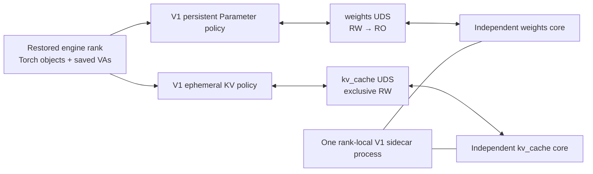
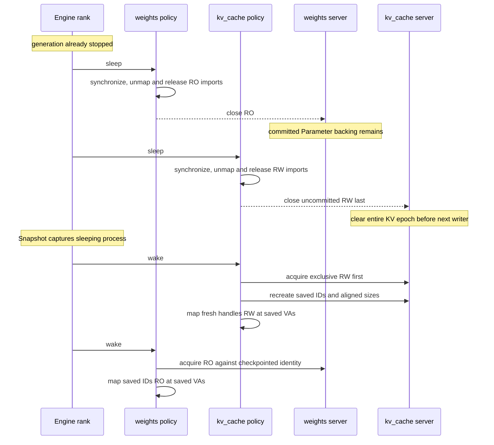
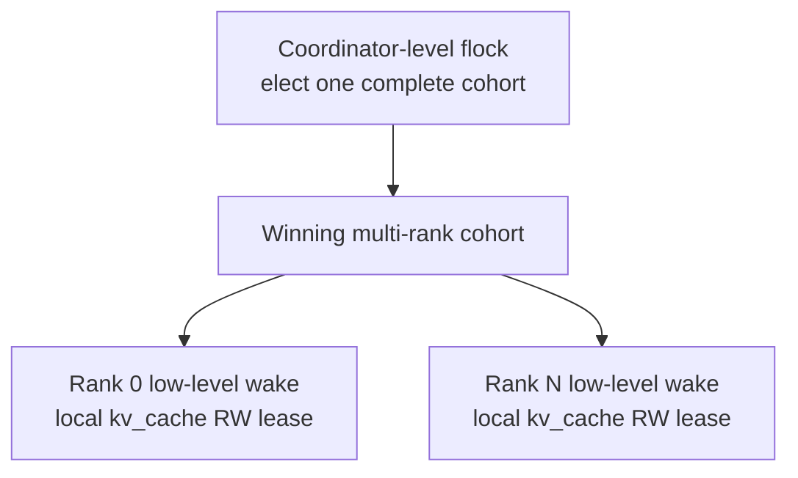

<!--
SPDX-FileCopyrightText: Copyright (c) 2026 NVIDIA CORPORATION & AFFILIATES. All rights reserved.
SPDX-License-Identifier: Apache-2.0
-->

# GPU Memory Service V1

GMS V1 is the rank-local memory layer for engines restored from a Dynamo
Snapshot. Snapshot always captures an engine that has already slept. CRIU
preserves its process, Torch objects, tensor layouts, allocation IDs, and CUDA
virtual-address reservations. GMS owns only the physical backing that is
reattached at those saved addresses.

V1 does not reconstruct a model or restore KV contents. It has no meta-model,
custom model loader, tensor metadata manifest, scratch allocation, allocation
pruning, or generic Snapshot lifecycle.

## Two memory domains

One sidecar process per engine rank serves two independent Unix-domain sockets:

| Domain | Session policy | Sleep result | Wake result |
|---|---|---|---|
| `weights` | Persistent RW-to-RO publication | Local RO imports close; sidecar retains committed allocations | Saved allocation IDs map RO at saved VAs |
| `kv_cache` | Ephemeral, exclusive RW epoch | Local imports close; RW disconnect clears all sidecar allocations | Saved IDs and sizes receive fresh handles mapped RW at saved VAs |

Both domains use the shared GMS core for allocation ownership, session
admission, transient `SCM_RIGHTS` exports, and CUDA VMM operations. They do not
share allocation state or session state.



The connected socket is the lease. A `kv_cache` RW session excludes another
writer. Disconnecting it clears and releases the whole uncommitted KV epoch
before the next writer is admitted. The active engine retains this lease while
it can access KV memory, so process death is also a rank-local memory fence.

The server retains CUDA handles, not one POSIX FD per allocation. Every export
creates a transient FD, sends it with `SCM_RIGHTS`, and closes the server copy.
The client import consumes and closes its received copy.

## Construction

V1 uses vLLM's existing broad allocator scopes and its normal model loader:

1. The `weights` scope enters the GMS Parameter MemPool.
2. vLLM performs normal model construction, loading, quantization, and
   post-load transforms.
3. V1 leaves final `nn.Parameter` objects on GMS storage and copies captured
   non-Parameter tensors to default-allocator storage.
4. Surviving Parameter mappings become read-only and the same `weights` socket
   commits from RW to RO.
5. The `kv_cache` scope enters the GMS KV MemPool.
6. vLLM creates its normal KV tensors through the ephemeral manager while the
   process retains the exclusive `kv_cache` RW socket.

Other allocation scopes retain vLLM's existing behavior. V1 subclasses only
vLLM's `SleepModeBackend`; it does not use `CuMemBackend` or `CuMemAllocator`
for weight or KV sleep and wake.

## Sleep and wake



KV tensor objects, mapping records, allocation IDs, sizes, and VA reservations
survive sleep. KV contents and physical handles do not. Fresh backing is
uninitialized; vLLM's normal post-wake path prepares the cache for use.

Suspend unmaps and closes Parameters before touching KV, retaining the active KV
lease until local memory is asleep. Resume acquires, recreates, and maps KV
before mapping Parameters. Any error is fatal. V1 does not retry, roll back,
fall back to native allocation, or continue with a partial wake.

## Multi-rank ownership

V1's backend is deliberately rank-local. It does not acquire a filesystem lock
and does not elect a TP/PP/DP cohort.



Coordinator-level flock and collective cohort selection remain outside this
package and this change. Only the winning cohort may call low-level wake. Once
called, each rank's `kv_cache` RW socket fences its local physical-memory epoch.
The two lock levels are complementary and must not be collapsed into the
per-rank backend.

## Running V1

Start one two-domain sidecar per rank:

```text
gms-v1-server --device 0
```

Select the V1 worker while retaining vLLM's normal load format:

```text
python -m dynamo.vllm ... \
  --worker-cls gpu_memory_service.v1.integrations.vllm.worker.GMSV1Worker
```
