<!--
SPDX-FileCopyrightText: Copyright (c) 2026 NVIDIA CORPORATION & AFFILIATES. All rights reserved.
SPDX-License-Identifier: Apache-2.0
-->

# GPU Memory Service Snapshot V1

Snapshot V1 is an experimental, minimal profile over the shared rank-local GPU
Memory Service (GMS) core. It keeps model Parameter backing outside a Dynamo
Snapshot while Snapshot/CRIU preserves the process, Python/Torch object graph,
StorageImpls, aliases, and CUDA virtual addresses.

## Architecture

This lower stack layer introduces the neutral internal core for both profiles:

```text
V0 (upper stack layer) -> gpu_memory_service.core <- Snapshot V1
```

| Module | Responsibility |
|---|---|
| Core | Session/epoch FSM, physical CUDA handles, transient FD export, neutral local VMM mapping operations, generic Torch allocator/MemPool construction, and alias-preserving tensor isolation |
| V0 | The lower layer leaves V0 unchanged; the upper layer migrates its typed wire adapter, tags/layout/hash, metadata, reconstruction, structural rematching, retained-source publication, framework accounting/compatibility, and mutable/scratch KV over the core |
| Snapshot V1 | Minimal wire policy, deterministic constructor/commit/sleep/wake entry points, final TensorImpl discovery/accounting, one-shot capture ordering, and native vLLM KV composition |

The core physical record contains only an aligned size and the retained CUDA
generic allocation handle. Allocation IDs are opaque. It contains no tensor
path, StorageImpl, virtual address, tag, layout slot, structural hash,
mutability class, generation, or model artifact.

Snapshot V1 uses the core server and session client directly. The upper V0
migration consumes the same local reserve/import/map/access/unmap/release
operations, Torch allocator construction, and tensor-isolation primitive while
keeping its established public protocol and reconstruction behavior. Snapshot
policy and framework knowledge do not enter the core.

### Client/server boundary

The Unix-domain socket is the process and ownership boundary:

| Location | Process | Owns |
|---|---|---|
| `core/server/` | Rank-local GMS sidecar | Session/epoch admission, retained physical CUDA handles, transient export FDs, and baseline RPC dispatch |
| `core/client/` | Engine worker | Neutral local mapping records and reserve/import/map/access/VA-preserving-unmap mechanisms |
| `core/client/torch/` | Engine worker | Generic Torch allocator callbacks, MemPool construction, storage grouping, copying, and alias-preserving tensor rebinding |
| `v1/cli.py` | Sidecar entry point | Device/socket selection and composition of the core server |
| `v1/` | Engine worker profile | Deterministic Snapshot mapping/Torch lifecycle, final live-tensor discovery/accounting, and native vLLM KV ordering |
| `server/`, `client/`, `integrations/` | Existing V0 sidecar and workers | The lower layer leaves these unchanged; the upper migration retains V0 wire, metadata, retained-source publication, reconstruction, scratch/mutable KV, and framework behavior |

Core server code never stores client VAs or framework objects. Core client code never
owns server allocation handles; it owns only imported local handles and
reservations. The upper migration keeps V0's separate client and server
adapters because its established wire and reconstruction features extend both
sides.

## Core sessions and epochs

The connected, handshaken Unix-domain socket is the cooperative lock lease:

- one read-write (RW) session excludes all readers;
- multiple read-only (RO) sessions share a committed epoch;
- `RW_OR_RO` becomes RW on an empty epoch or RO on a committed epoch;
- an explicit waiting writer blocks late RO and `RW_OR_RO` readers;
- commit atomically moves the same session and socket from RW to RO;
- an uncommitted writer disconnect clears the partial epoch;
- reader disconnect removes only that reader and retains committed backing;
- the last reader leaves the allocation set committed; and
- a future writer waits for every reader, then clears the old epoch before it
  starts; and
- a queued writer whose socket reaches EOF/reset is removed promptly and
  cannot reserve or clear the committed epoch.

Socket close is the only lease-release operation. There is no unlock RPC,
heartbeat, TTL, mapping revocation, transparent reconnect, or mutation replay.

The server retains no POSIX export FD per allocation. Each export creates a
fresh FD from the retained CUDA handle. The protocol adapter sends it with
`SCM_RIGHTS` and closes its copy after the send. The client import consumes and
closes the received FD on success or failure.

Client failures are fail-stop. If VA reservation fails before import, the
still-local received FD is closed. Once import, mapping, commit, sleep, or wake
begins, an error closes the profile session and propagates; GMS does not send
compensating requests, reverse partial CUDA state, retry, or continue serving
that engine attempt.

## Deterministic V1 lifecycle

The built-in V1 engine lifecycle exposes no lock-mode configuration: it
selects RW for fresh construction and RO for restored wake. The core still
accepts `RW_OR_RO` for V0 and custom low-level clients.

```mermaid
stateDiagram-v2
    [*] --> CONSTRUCTING: constructor opens RW
    CONSTRUCTING --> COMMITTED: mappings RO; same socket commits to RO
    COMMITTED --> ASLEEP: unmap imports; close RO
    ASLEEP --> COMMITTED: restored wake opens RO; remap exact IDs and VAs
```



A fresh backend constructor always opens RW. Commit synchronizes CUDA, sets
every managed mapping RO, and publishes on that same socket; it does not
disconnect or return to RW. Sleep synchronizes, unmaps and releases every
local import while preserving allocation IDs and VA reservations, then closes
RO. Snapshot captures that sleeping object.

CRIU restore does not rerun constructors. Wake therefore always opens RO,
passes the checkpointed sidecar nonce and physical GPU UUID in the handshake,
checks the local physical GPU, exports the exact saved allocation IDs, and
maps them RO at the exact saved VAs. The client derives its phase from the
socket mode and mapping/import ownership; it has no duplicate lifecycle FSM.
Retire frees only local imports and reservations and closes RO; it never frees
committed sidecar backing.

## Broad vLLM weight capture

The worker uses vLLM's existing broad `weights` allocator context as the one
capture and provenance seam. It does not replace vLLM's normal model loader.

1. The backend enters one temporary GMS-backed Torch MemPool.
2. vLLM performs normal model construction, loading, quantization, and
   post-load transformations.
3. After leaving `torch.cuda.use_mem_pool`, Torch allocations again use the
   default CUDA allocator.
4. V1 inspects the final live tensor graph, deduplicates TensorImpl owners, and
   groups captured tensors by source StorageImpl.
5. Every final `nn.Parameter` TensorImpl remains on GMS backing.
6. Every captured literal non-Parameter TensorImpl moves to compact
   default-allocator backing while preserving shape, stride, dtype, storage
   offset, and overlapping non-Parameter aliases.
7. Parameter/non-Parameter storage aliasing is deliberately severed.
8. Temporary-pool destruction returns dead captured allocations through the
   normal allocator callbacks.
9. The surviving GMS Parameter domain becomes RO and commits.

The storage grouping, compact copy, and alias-preserving rebinding operation is
the common primitive the upper V0 migration consumes. Snapshot V1 owns
only process-wide final TensorImpl discovery, Parameter classification,
accounting, and immediate normalize/destroy/commit ordering. V0 invokes the
same primitive after named module discovery and retain source storage for
deferred metadata publication.

Default-allocator tensors and non-Torch CUDA allocations are untouched.
Copied-out tensors retain ordinary `gc.collect()` and
`torch.cuda.empty_cache()` behavior.

Commit logs once per rank/device:

- unique physical byte-span coverage retained by Parameters;
- aligned retained GMS bytes and allocation count;
- Parameter-span-to-allocated ratio;
- fragmentation bytes and percentage; and
- actual unique bytes copied to the default allocator.

There is no custom V1 model loader, meta-model construction, persistent tensor
manifest, allocation census/pruning pass, workspace patch, model-family or
quantization conditional, server-side VA, layout guard, compatibility
fallback, or two-phase commit.

## KV and Snapshot ordering

GMS owns only the committed Parameter domain. Native vLLM tagged
`CuMemAllocator` continues to own KV-cache backing.

Level-1 sleep first asks native vLLM CuMem to discard KV backing without a CPU
copy. GMS then unmaps Parameters and closes RO. Capture occurs only after both
steps, with CUDA graph state preserved.

Wake maps GMS Parameters first. Native vLLM CuMem then recreates KV backing at
its preserved VAs and runs the normal post-KV wake hook. Whole-engine level-1
sleep and untagged wake are the supported interface.

## V0 and loader distinctions

V0 remains the profile for reconstructing a fresh process from GMS metadata.
Its framework integrations may install custom model loaders, create a
meta-model, materialize tensor/storage metadata, structurally rematch
equivalent layouts, consume `RW_OR_RO`, and reallocate mutable or scratch KV.
Those are V0 extensions rather than shared physical/session state.

Three loading paths are distinct:

| Path | Purpose |
|---|---|
| V0 framework model loader | Reconstruct a fresh framework process from V0 metadata |
| Cold-storage GMS loader | Recreate exact rank-local allocation IDs and contents on a fresh GMS server, then commit |
| Live-server Snapshot shadow | Wake against allocation IDs already retained by the running rank-local GMS server; no loader is needed |

## Multi-rank and failover

There is one independent GMS server per rank. Each rank process contacts only
its local server. GMS does not elect engine cohorts or coordinate a
distributed transaction.

- every fresh V1 rank constructs a manager and therefore opens RW;
- every Snapshot-restored rank resumes asleep and therefore opens RO;
- active failover election occurs once at the engine-cohort level, normally at
  its leader/rank 0;
- the orchestrator sleeps or resumes all ranks together; and
- a distributed-rank failure must clean up the complete cohort so all
  rank-local sockets close.

Snapshot/operator orchestration, not GMS, decides when every source rank is
committed, restores complete rank cohorts, and admits a cohort after any
cold-server loaders finish. Operator replenishment wiring is outside this
profile.

## vLLM usage

Start one sidecar per rank:

```text
gms-v1-server --device 0 [--socket-path PATH]
```

Select the V1 worker while keeping the normal vLLM load format:

```text
python -m dynamo.vllm ... \
  --worker-cls gpu_memory_service.v1.integrations.vllm.worker.GMSV1Worker
```

The worker eagerly selects the V1 sleep backend after CUDA device
initialization. Its broad `weights` context routes to the one-shot GMS capture;
all other allocator tags delegate unchanged to vLLM.
