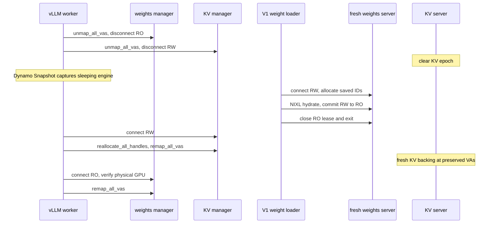

<!--
SPDX-FileCopyrightText: Copyright (c) 2026 NVIDIA CORPORATION & AFFILIATES. All rights reserved.
SPDX-License-Identifier: Apache-2.0
-->

# GPU Memory Service V1

GMS V1 is an experimental, rank-local memory owner for engines restored by
Dynamo Snapshot. It is fail-stop: errors terminate the worker rather than
retrying, rolling back, falling back to native allocation, or continuing after
a partial wake.

## Snapshot assumptions

Dynamo Snapshot captures only after whole-engine GMS sleep. Restore preserves:

- the same Python and Torch process state;
- the same TensorImpls and post-partition StorageImpl graph;
- tensor layouts;
- GMS allocation IDs; and
- CUDA virtual-address reservations.

Model construction, model loading, and non-Parameter storage copy-out do not
run again after restore. Default-allocator copies are ordinary process-owned
Snapshot state.

Committed weight allocations can be saved as raw shards before Snapshot
capture and hydrated under the same allocation IDs in a fresh rank-local V1
server. The restored process then imports those allocations at its preserved
virtual addresses.

KV TensorImpls, mapping records, allocation IDs, sizes, and VA reservations also
survive. KV physical backing and contents do not. Wake creates fresh backing
under the saved IDs and maps it at the preserved VAs before vLLM prepares the
cache for use.

## Ownership

`GMSV1Worker._maybe_get_memory_pool_context(tag)` is the vLLM routing seam.
`weights` and `kv_cache` delegate to one `GMSV1SleepModeBackend`; every other
tag follows vLLM's normal implementation.

```text
GMSV1Worker
  _maybe_get_memory_pool_context(tag)
    -> GMSV1SleepModeBackend
         owns one CUDAPluggableAllocator
         owns temporary weights MemPool + long-lived KV MemPool
         owns two GMSClientMemoryManager instances
              weights -> weights.sock
              kv      -> kv_cache.sock

sidecar per rank:
  weights.sock  -> GMSServerMemoryManager + independent allocations and sessions
  kv_cache.sock -> GMSServerMemoryManager + independent allocations and sessions
```

The pluggable allocator outlives both MemPools. Allocation callbacks route by
the active domain. Free callbacks route by VA ownership because Torch can free
outside the context that allocated the storage. C free callbacks cannot
reliably propagate Python exceptions, so the backend latches and surfaces the
first callback failure.

Both client domains use the same `GMSClientMemoryManager` class and the same
V0-style operations:

| Operation | Purpose |
|---|---|
| `connect` / `disconnect` | Acquire or release the socket lease |
| `create_mapping` / `destroy_mapping` | Own one server allocation and local VA |
| `commit` | Change the same weights socket and mappings from RW to RO |
| `unmap_all_vas` | Drop imported handles but preserve IDs, sizes, and VAs |
| `reallocate_all_handles` | Recreate ephemeral server backing under saved IDs |
| `remap_all_vas` | Install server backing at saved VAs |
| `close` | Release local mappings and the socket |

Each Unix-domain socket is its lease. A writer excludes all other sessions.
Committed weights can have shared readers. Waiting writers have priority over
new readers. A same-socket commit changes RW to RO atomically. Disconnecting an
uncommitted writer clears its complete allocation epoch before another writer
is admitted. Reader disconnect only releases that reader.

The server retains allocation IDs, aligned sizes, and CUDA handles rather than
persistent export FDs. Each export
creates a transient FD, transfers it with `SCM_RIGHTS`, and closes the server
copy. Client import consumes and closes the received copy. The wire protocol is
a small typed `msgspec.Struct` MessagePack protocol; there is no JSON
compatibility path.

## Cold weight storage

The existing checkpoint saver with `--use-v1` connects RO to the rank-local
`weights` socket, enumerates the committed allocation IDs and aligned sizes,
temporarily imports them, and writes raw shard bytes. Its manifest contains
only a version and, for each allocation, its exact ID, aligned size, shard
path, and shard offset.

On restore, the existing checkpoint loader with `--use-v1` connects RW to a
fresh `weights` socket, recreates the exact IDs and sizes, temporarily imports
them, and restores the shard bytes through the existing NIXL transfer backend.
It synchronizes and releases its temporary mappings, commits the same socket
RW to RO, closes its lease, and exits. The server retains the committed backing
while the restored worker acquires a new RO lease and remaps its preserved VAs.
Neither path uses V0 tensor metadata or the V0 memory manager.

## Weight construction

V1 uses vLLM's normal model loader inside its broad weights allocation scope:

1. Connect `weights` RW and enter the temporary GMS weights MemPool.
2. Run model construction, loading, quantization, and post-load transforms.
3. Leave the GMS MemPool.
4. Copy live non-Parameter tensors from GMS storage to Torch's default
   allocator while preserving TensorImpl identity and non-Parameter aliases.
5. Synchronize CUDA.
6. Destroy the weights MemPool and collect dead mappings.
7. Surface any allocator callback failure.
8. Protect surviving Parameter mappings RO and commit the same socket RW to RO.

The storage copy operates on each overlapping connected component of bounding
storage byte ranges, not on an entire StorageImpl and not once per tensor.
Relative aliases and offsets inside a copied component are preserved. Disjoint
components get separate storage. Absolute non-empty storage offsets may be
rebased. Mixed Parameter/non-Parameter aliasing is deliberately severed.

See `parameter_storage.py` and
`core/client/torch/storage_rebinding.py` for the detailed before/after diagram
and implementation.

The commit log reports Parameter span bytes, retained aligned GMS bytes,
uncovered retained bytes and ratio, copied-out bytes, and retained allocation
count.

## Sleep and wake



Suspend order is weights then KV so the exclusive KV lease remains held until
local weight memory is asleep. Resume order is KV then weights.

Every connection verifies the physical GPU identity. A server nonce is not
pinned because cold restore deliberately connects the checkpointed client to a
fresh server incarnation. V1 does not reconstruct models, retain KV contents,
scan raw mappings, validate model-specific layouts, or implement SGLang
integration.

## Running V1

Start one V1 child per visible device:

```text
python3 -m gpu_memory_service.cli.server --use-v1
```

The supervisor discovers the visible devices and monitors the children. To
start one rank-local child directly:

```text
gpu-memory-service --use-v1 --device 0
```

Save or hydrate that rank's weight artifact under
`<checkpoint-dir>/device-0`:

```text
python -m gpu_memory_service.cli.snapshot.saver --use-v1 \
  --checkpoint-dir /checkpoints/run/versions/1 --device 0
python -m gpu_memory_service.cli.snapshot.loader --use-v1 \
  --checkpoint-dir /checkpoints/run/versions/1 --device 0
```

The V1 loader exits after hydration. Start one server and loader per rank/device
with the restored worker's `GMS_SOCKET_DIR`. Only the `weights` socket is used.

Select the worker while retaining vLLM's normal load format:

```text
python -m dynamo.vllm ... \
  --worker-cls gpu_memory_service.v1.integrations.vllm.worker.GMSV1Worker
```
